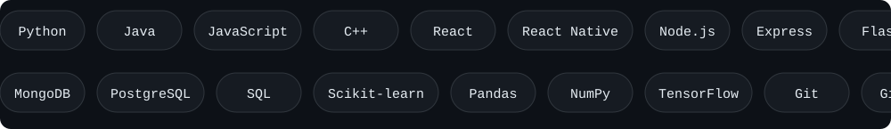
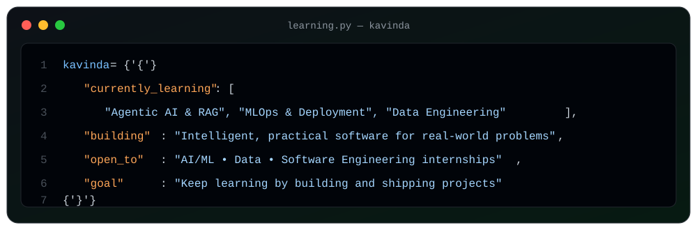

<div align="center">

  <picture>
    <source media="(prefers-color-scheme: dark)" srcset="profile_card.svg" />
    
  </picture>

</div>

<br />

<div align="center">
  
</div>

---

### 🧑‍💻 About Me

```bash
$ cat profile.txt

  Name       :  Kavinda Heshan Ranasinghe
  Degree     :  BSc (Hons) Information Technology — AI Specialization
  University :  Sri Lanka Institute of Information Technology (SLIIT)
  Year       :  3rd Year, Semester 1
  Location   :  Malabe, Sri Lanka 🇱🇰
  Focus      :  AI/ML • Agentic AI • Data Engineering • Full-Stack Development
  Open To    :  AI/ML • Data • Software Engineering Internship Opportunities
  Achievement:  Dean's List — 2nd Year, 1st Semester
  Motto      :  "Learn. Build. Improve. Repeat." 🚀
```

---

### 🛠️ Languages & Tools

<div align="center">
  
</div>

<p align="center">
  
</p>

---

### 🚀 Featured Projects

| Project | Description | Stack | Link |
|---|---|---|---|
| 🍔 **QuickBite** | Multi-canteen pre-order system for campus food ordering and canteen management | `React Native` `Node.js` `Express` `MongoDB` | [Repository](https://github.com/ranasinghekavinda03/QuickBite) |
| 🅿️ **ParkingPulse-LK** | Smart parking web application with availability reporting, status tracking and parking information | `React` `.NET` `PostgreSQL` | [Repository](https://github.com/ranasinghekavinda03/ParkingPulse-LK) |
| 📦 **MERN Item Manager** | Full-stack CRUD application for creating, viewing, updating and managing items | `React` `Node.js` `Express` `MongoDB` | [Repository](https://github.com/ranasinghekavinda03/mern-item-managers) |
| 🚗 **Vehicle IQ** | ML-based second-hand vehicle price prediction system with preprocessing and regression model evaluation | `Python` `Flask` `scikit-learn` `Pandas` | *Portfolio project* |

---

### 🎓 Education & Achievement

| | |
|---|---|
| 🎓 **Degree** | BSc (Hons) in Information Technology — Artificial Intelligence |
| 🏫 **University** | Sri Lanka Institute of Information Technology (SLIIT) |
| 📅 **Duration** | 2024 – 2028 (Expected) |
| 🏆 **Achievement** | Dean's List — 2nd Year, 1st Semester |

---

### 📊 GitHub Stats

<p align="center">
  
  &nbsp;
  
</p>

<p align="center">
  
</p>

---

### 📡 Contribution Activity

<p align="center">
  
</p>

---

### 🧠 Currently Learning

<p align="center">
  
</p>

---

### 🌐 Connect With Me

<p align="center">
  <a href="https://www.linkedin.com/in/kavinda-ranasinghe-ab4aa33bb">
    
  </a>&nbsp;&nbsp;
  <a href="mailto:ranasinghe.kavinda03@gmail.com">
    
  </a>&nbsp;&nbsp;
  <a href="https://github.com/ranasinghekavinda03">
    
  </a>
</p>

<div align="center">
  
  <br/><br/>
  <i>Building skills through real projects, one commit at a time.</i>
</div>
